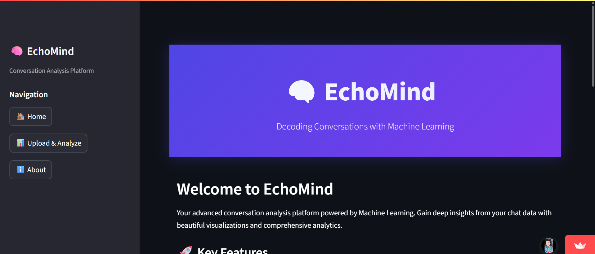
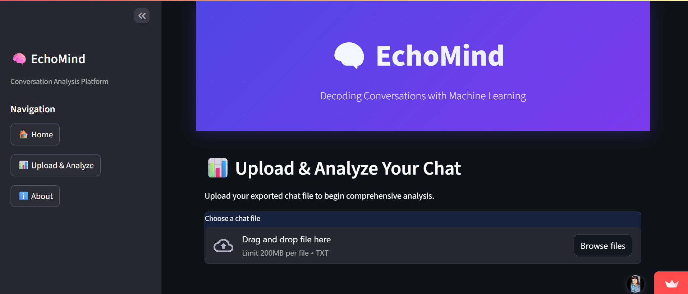
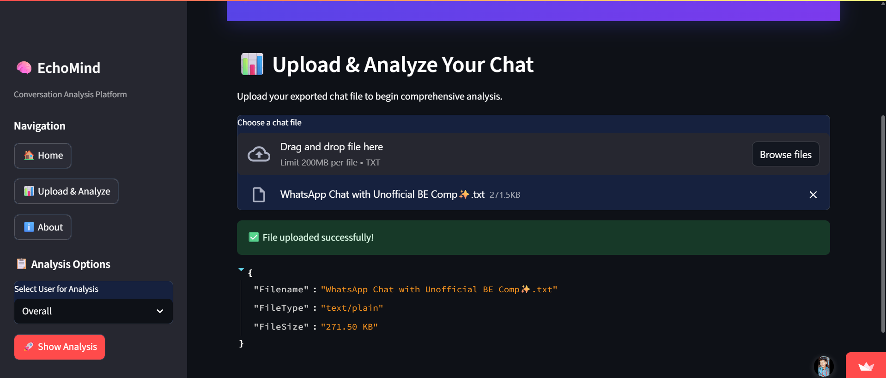
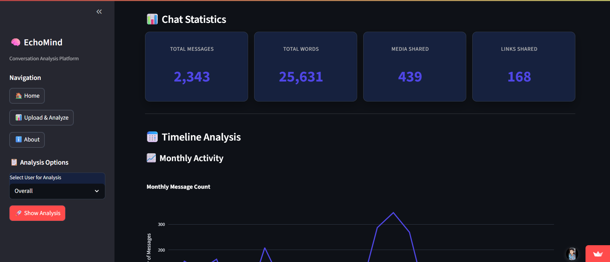
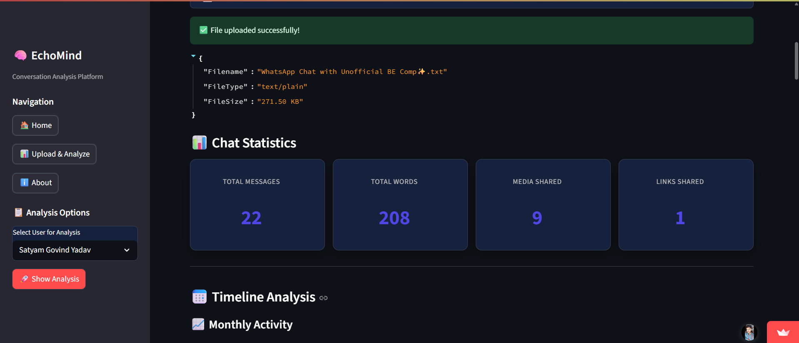
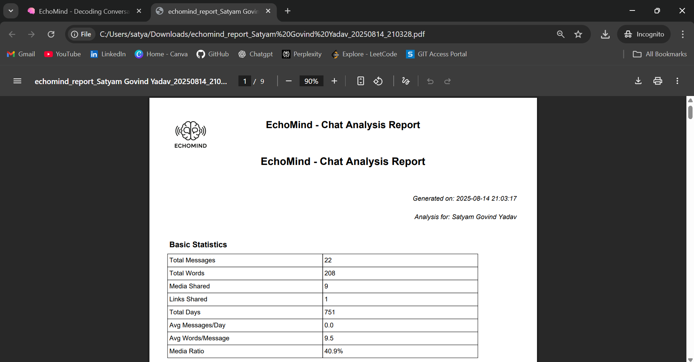
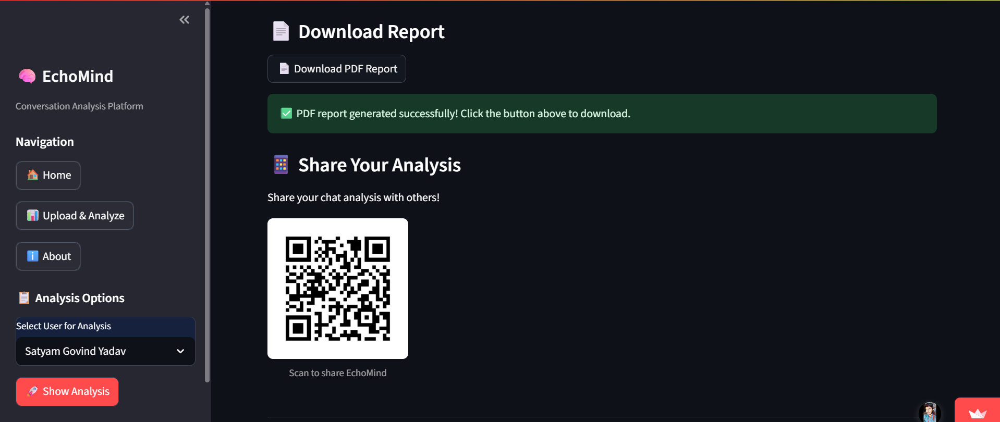

# 🧠 EchoMind - Decoding Conversations with Machine Learning

A comprehensive conversation analysis platform that leverages Machine Learning to provide deep insights into chat data patterns, sentiment analysis, and user engagement metrics.

## 📸 Project Screenshots

### 🏠 Homepage

*Welcome to EchoMind - Your advanced conversation analysis platform powered by Machine Learning*

### 📊 Upload & Analyze Interface

*Upload your chat data and access comprehensive analysis tools*

### 📁 Demo File Upload

*Successfully uploaded chat file with detailed file information*

### 📈 Overall Chat Statistics

*Comprehensive group chat analysis with detailed metrics and visualizations*

### 👤 Individual Chat Statistics

*Personal chat analysis with user-specific insights and patterns*

### 📄 PDF Report Generation

*Professional PDF reports with all analysis data and visualizations*

### 📱 QR Code & Sharing

*Easy sharing with QR codes and downloadable PDF reports*

## 🚀 Features

### 📊 Conversation Analytics
- **Message Statistics**: Total messages, words, media, and links
- **Timeline Analysis**: Monthly and daily message patterns
- **Activity Mapping**: Weekly and monthly activity heatmaps
- **User Comparison**: Group chat user activity analysis

### 🔍 Advanced Analysis
- **Word Cloud Generation**: Visual representation of common words
- **Emoji Analysis**: Most used emojis and frequency patterns
- **Sentiment Insights**: Emotional tone analysis of conversations
- **Trend Detection**: Pattern recognition over time

### 📱 User Experience
- **Dark Mode Interface**: Modern, eye-friendly design
- **Responsive Design**: Optimized for all devices
- **Interactive Charts**: Plotly-powered visualizations
- **Real-time Processing**: Instant analysis results

### 📄 Export & Sharing
- **PDF Reports**: Professional analysis reports
- **QR Code Sharing**: Easy app sharing
- **Data Export**: Downloadable analysis data
- **Visual Charts**: High-quality chart exports

## 🛠️ Technology Stack

### Frontend
- **Streamlit**: Web application framework
- **HTML/CSS**: Custom styling and responsive design
- **JavaScript**: Interactive elements and animations

### Backend
- **Python**: Core programming language
- **Pandas**: Data manipulation and analysis
- **NumPy**: Numerical computations
- **Matplotlib/Seaborn**: Chart generation

### Machine Learning
- **Natural Language Processing**: Text analysis and preprocessing
- **Sentiment Analysis**: Emotional tone detection
- **Pattern Recognition**: Conversation trend analysis

### Data Processing
- **Text Preprocessing**: Chat data cleaning and formatting
- **Emoji Detection**: Unicode emoji analysis
- **Word Frequency**: Statistical text analysis

## 🚀 Getting Started

### Prerequisites
- Python 3.8 or higher
- pip package manager
- Modern web browser

### Installation

1. **Clone the repository**
   ```bash
   git clone https://github.com/satyamyadav6286/EchoMind---Decoding-Conversations-with-ML.git
   cd EchoMind---Decoding-Conversations-with-ML
   ```

2. **Install dependencies**
   ```bash
   pip install -r requirements.txt
   ```

3. **Run the application**
   ```bash
   streamlit run app.py
   ```

4. **Access the app**
   - Open your browser and go to `http://localhost:8501`
   - The app will automatically open in your default browser

## 📋 How to Use

### 1. Export Chat Data
- Export your WhatsApp chat (without media)
- Save as `.txt` format
- Ensure proper formatting for analysis

### 2. Upload and Analyze
- Navigate to "📊 Upload & Analyze" page
- Upload your chat file
- Select user for analysis (or choose "Overall" for group analysis)

### 3. Explore Insights
- View comprehensive statistics
- Analyze timeline patterns
- Explore activity heatmaps
- Review word clouds and emoji usage

### 4. Generate Reports
- Download detailed PDF reports
- Share analysis via QR codes
- Export data for further analysis

## 📱 Mobile Responsiveness

The application is fully optimized for mobile devices with:
- **Responsive Layout**: Adapts to all screen sizes
- **Touch-Friendly Interface**: Optimized for mobile navigation
- **Mobile-First Design**: Prioritizes mobile user experience
- **Optimized Charts**: Mobile-friendly visualizations
- **Fast Loading**: Optimized performance for mobile networks

## 👥 Project Team

### Satyam Govind Yadav
- **Role**: Lead Developer & ML Engineer
- **GitHub**: [satyamyadav6286](https://github.com/satyamyadav6286)
- **LinkedIn**: [Satyam Govind Yadav](https://www.linkedin.com/in/satyamgovindyadav/)

### Arunkumar Gupta
- **Role**: UI/UX Designer & Developer
- **GitHub**: [arun-060](https://github.com/arun-060)
- **LinkedIn**: [Arunkumar Gupta](https://www.linkedin.com/in/arunkumar-gupta-b62b0428b/)

## 📁 Project Structure

```
EchoMind---Decoding-Conversations-with-ML/
├── app.py                 # Main Streamlit application
├── helper.py             # Analysis helper functions
├── preprocessor.py       # Data preprocessing utilities
├── pdf_utils.py          # PDF generation and export
├── style.css             # Custom styling and responsive design
├── requirements.txt      # Python dependencies
├── README.md            # Project documentation
├── assets/              # Project assets and screenshots
│   └── screenshots/     # Application screenshots
└── logo.png             # Application logo
```

## 📦 Dependencies

### Core Dependencies
- `streamlit>=1.28.0`: Web application framework
- `pandas>=1.5.0`: Data manipulation and analysis
- `numpy>=1.24.0`: Numerical computations
- `plotly>=5.15.0`: Interactive visualizations
- `matplotlib>=3.6.0`: Static chart generation
- `seaborn>=0.12.0`: Statistical data visualization

### Additional Dependencies
- `fpdf>=1.7.2`: PDF generation
- `qrcode[pil]>=7.4.2`: QR code generation
- `Pillow>=9.0.0`: Image processing
- `requests>=2.28.0`: HTTP requests

## 🔮 Future Enhancements

### Planned Features
- **Real-time Chat Analysis**: Live conversation monitoring
- **Advanced Sentiment Analysis**: Deep learning-based emotion detection
- **Multi-language Support**: Analysis in multiple languages
- **API Integration**: RESTful API for external applications
- **Cloud Deployment**: Scalable cloud infrastructure

### Technical Improvements
- **Performance Optimization**: Faster data processing
- **Enhanced Visualizations**: 3D charts and interactive graphs
- **Machine Learning Models**: Advanced pattern recognition
- **Data Security**: Enhanced privacy and security features

## 🤝 Contributing

We welcome contributions from the community! Here's how you can help:

### How to Contribute
1. Fork the repository
2. Create a feature branch (`git checkout -b feature/AmazingFeature`)
3. Commit your changes (`git commit -m 'Add some AmazingFeature'`)
4. Push to the branch (`git push origin feature/AmazingFeature`)
5. Open a Pull Request

### Contribution Guidelines
- Follow the existing code style
- Add tests for new functionality
- Update documentation as needed
- Ensure all tests pass before submitting

## 📄 License

This project is licensed under the MIT License - see the [LICENSE](LICENSE) file for details.

## 🙏 Acknowledgments

- **Streamlit Team**: For the amazing web framework
- **Open Source Community**: For the libraries and tools used
- **Academic Community**: For research and development support
- **Beta Testers**: For valuable feedback and testing

## 📞 Contact

### Project Information
- **Project Link**: [https://github.com/satyamyadav6286/EchoMind---Decoding-Conversations-with-ML](https://github.com/satyamyadav6286/EchoMind---Decoding-Conversations-with-ML)
- **Live Demo**: [https://echomind-app.streamlit.app/](https://echomind-app.streamlit.app/)

### Team Contact
- **Satyam Govind Yadav**: [satyamyadav6286@gmail.com](mailto:satyamyadav6286@gmail.com)
- **Arunkumar Gupta**: [guptaarunkumar947@gmail.com](mailto:guptaarunkumar947@gmail.com)

---

<div align="center">

**🧠 EchoMind - Decoding Conversations with Machine Learning**

*Made with ❤️ by Satyam Govind Yadav & Arunkumar Gupta*

[](https://github.com/satyamyadav6286)
[](https://www.linkedin.com/in/satyamgovindyadav/)
[](https://echomind-app.streamlit.app/)

</div>
